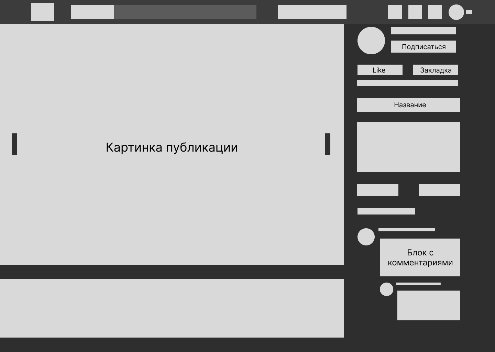

# webFans

*Напоминание. Это не инструкция к применению, а лишь шаблонное распределение методов, если так вышло,*
*что у вас появились промежуточные методы, вы вправе видоизменять соответсвующие таблицы*

;

## Изменить инфу по пользователю(клиент + сервер)
### Сервер
**Все изменения пользователя можно испольнить одним методом**

Выполняйте по аналогии с методом изменения публикации(написан)

*_editPublication(PublicationManager) -> edit(Publication) -> editPublication(DB)*

| Функционал | Статус | Студент | GitHub логин |
| ---------- | ------ | ------- | ------------ |
| Метод "_editUser" в UserManager | ожидается | ожидается | ожидается |
| Метод "edit" в User | ожидается | ожидается | ожидается |
| Метод "editUser" в DB | ожидается | ожидается | ожидается |

### Клиент
**Как я это вижу**

*У вас имеются инпуты для изменения информации пользователя*

*И кнопка, по которой разом вся информация из этих инпутов летит на сервак*

| Функционал | Статус | Студент | GitHub логин |
| ---------- | ------ | ------- | ------------ |
| Метод "editUser" в Server | ожидается | ожидается | ожидается |
| Метод "edit" в UserModule | ожидается | ожидается | ожидается |
| Метод "editUser" в Модуле, где будете подключать обработчик события | ожидается | ожидается | ожидается |

## Добавить публикацию
### Клиент
**Как я это вижу**

*Это все происходит на странице загрузки публикаций*

Создать страницу публикации: 

- Сделать кнопку 
- на обработчик события повесить роут на новую страницу
- На странице заполняешь инпуты
- Должен быть флажок на отложенную публикацию и на запрет коментов.
- Должен быть флажок, отложенна ли публикация и если он стоит, тогда указано время

| Функционал | Статус | Студент | GitHub логин |
| ---------- | ------ | ------- | ------------ |
| Метод "addPublication" в Server | ожидается | ожидается | ожидается |
| Метод "add" в PublicationModule | ожидается | ожидается | ожидается |
| Метод "addPublication" в Модуле, где будете подключать обработчик события | ожидается | ожидается | ожидается |

## Изменить публикацию
### Клиент
**Как я это вижу**

*Это происходит на внутренней странице публикации*

- Нажате на публикацию 
- открывает страницу публикации
- Взять id публикации
- Нажатие на кнопку "Изменить"
- Отправить инфу на сервер
- Меняешь инпуты с инфой.

| Функционал | Статус | Студент | GitHub логин |
| ---------- | ------ | ------- | ------------ |
| Метод "editPublication" в Server | ожидается | ожидается | ожидается |
| Метод "edit" в PublicationModule | ожидается | ожидается | ожидается |
| Метод "editPublication" в Модуле, где будете подключать обработчик события | ожидается | ожидается | ожидается |

## Удалить публикацию
### Клиент
**Как я это вижу**

*Это происходит на внутренней странице публикации*

Создать страницу публикации: 

- Нажате на публикацию
- открывает страницу публикации
- Взять id публикации
- Нажатие на кнопку "Удалить"
- Отправить инфу на сервер
- Подтверждаешь

| Функционал | Статус | Студент | GitHub логин |
| ---------- | ------ | ------- | ------------ |
| Метод "deletePublication" в Server | ожидается | ожидается | ожидается |
| Метод "delete" в PublicationModule | ожидается | ожидается | ожидается |
| Метод "deletePublication" в Модуле, где будете подключать обработчик события | ожидается | ожидается | ожидается |

## Поставить/убрать лайк с публикации
### Клиент
**Как я это вижу**

*Это происходит на внутренней странице публикации*

- Нажать на лайк
- Взять id публикации
- Отправить инфу на сервер

| Функционал | Статус | Студент | GitHub логин |
| ---------- | ------ | ------- | ------------ |
| Метод "likePublication" в Server | ожидается | ожидается | ожидается |
| Метод "like" в PublicationModule | ожидается | ожидается | ожидается |
| Метод "likePublication" в Модуле, где будете подключать обработчик события | ожидается | ожидается | ожидается |

## Получить публикацию
### Клиент
**Как я это вижу**

- Нажать на миниатюру публикации
- Взять id публикации
- Отправить инфу на сервер

| Функционал | Статус | Студент | GitHub логин |
| ---------- | ------ | ------- | ------------ |
| Метод "getPublication" в Server | ожидается | ожидается | ожидается |
| Метод "get" в PublicationModule | ожидается | ожидается | ожидается |
| Метод "getPublication" в Модуле, где будете подключать обработчик события | ожидается | ожидается | ожидается |

## Получить публикации, лайкнутые пользователем
### Клиент
**Как я это вижу**

- На странице пользователя нажать на кнопку "Понравившееся"
- Взять id пользователся
- Отправить инфу на сервер

| Функционал | Статус | Студент | GitHub логин |
| ---------- | ------ | ------- | ------------ |
| Метод "getUserPublications" в Server | ожидается | ожидается | ожидается |
| Метод "getByUser" в PublicationModule | ожидается | ожидается | ожидается |
| Метод "getUserPublications" в Модуле, где будете подключать обработчик события | ожидается | ожидается | ожидается |

## Добавить комент к публикации
### Клиент
**Как я это вижу**

*Это происходит на внутренней странице публикации*

- по id публикации запросить инфу разрешены ли коменты к этой публикации (метод getPublication)
- по id публикации и юзера запросить инфу по юзру(может ли он оставлять коменты к данной публикации)(isBlocked)
- Заполнить textarea
- Нажать на "Отправить"
- Отправить инфу на сервер

| Функционал | Статус | Студент | GitHub логин |
| ---------- | ------ | ------- | ------------ |
| Метод "isBlocked" в Server | ожидается | ожидается | ожидается |
| Метод "addComment" в Server | ожидается | ожидается | ожидается |
| Метод "addComment" в PublicationModule | ожидается | ожидается | ожидается |
| Метод "addComment" в Модуле, где будете подключать обработчик события | ожидается | ожидается | ожидается |

## Добавить комент к публикации
### Клиент
**Как я это вижу**

*Это происходит на внутренней странице публикации*

- по id публикации запросить инфу о коментах данного юзера
- Нажать на кнопку изменить на коменте
- Заполнить textarea
- Нажать на "Отправить"
- Отправить инфу на сервер

| Функционал | Статус | Студент | GitHub логин |
| ---------- | ------ | ------- | ------------ |
| Метод "editComment" в Server | ожидается | ожидается | ожидается |
| Метод "editComment" в PublicationModule | ожидается | ожидается | ожидается |
| Метод "editComment" в Модуле, где будете подключать обработчик события | ожидается | ожидается | ожидается |

## Подписаться(отписаться) на(от) пользователя
### Клиент
**Как я это вижу**

*на любом из экранов, где есть кнопка "подписаться"*

- Проверить, не подписан ли уже пользователь
- Нажать на кнопку "подписаться"("отписаться")
- Отправить инфу на сервер

| Функционал | Статус | Студент | GitHub логин |
| ---------- | ------ | ------- | ------------ |
| Метод "isFollowed" в Server | ожидается | ожидается | ожидается |
| Метод "followUser"("unfollowUser") в Server | ожидается | ожидается | ожидается |
| Метод "follow"("unfollow") в UserModule | ожидается | ожидается | ожидается |
| Метод "followUser"("unfollowUser") в Модуле, где будете подключать обработчик события | ожидается | ожидается | ожидается |

### Сервер
**Как я это вижу**

- Из активных записей в userModule вытаскиваете юзера, который подписывается
- Проверяете подписан ли он на пользователя
- Подписываетесь(отписываетсь)

| Функционал | Статус | Студент | GitHub логин |
| ---------- | ------ | ------- | ------------ |
| Метод "_isFollowed" в UserManager | ожидается | ожидается | ожидается |
| Метод "_followUser"("_unfollowUser") в UserManager | ожидается | ожидается | ожидается |
| Метод "follow"("unfollow") в User | ожидается | ожидается | ожидается |
| Метод "followUser"("unfollowUser") в DB | ожидается | ожидается | ожидается |

## Отправить уведомление о публикации(отложенной публикации)
### Клиент
**Как я это вижу**

- В сокетах подписываетесь на событие уведомления, которое прилетит с сервака.
- Когда прилетело, выводите оповещение клиенту

| Функционал | Статус | Студент | GitHub логин |
| ---------- | ------ | ------- | ------------ |
| Метод "getNotified" в Server | ожидается | ожидается | ожидается |
| Метод "showNotification" хоть в alert выводите | ожидается | ожидается | ожидается |

### Сервер
**Как я это вижу**

- При создании публикации, если она прилетела с отложенным таймером закинуть эту публикацию в активные записи
- Завести таймер и через определенное время(или промежутки) оправить публикацию всем, кто подписан на пользователя(сокетом)
- Если она прилетела без таймера, стразу сокетом отослать уведомление всем, кто подписан на пользователся

| Функционал | Статус | Студент | GitHub логин |
| ---------- | ------ | ------- | ------------ |
| Дописать "_addPublication" в PublicationManager | ожидается | ожидается | ожидается |
| Метод "getFollowedUsers" в PublicationManager | ожидается | ожидается | ожидается |

## Заблокировать комментарии/публикацию/пользователя для пользователя
### Клиент
**Как я это вижу**

*в любом месте, где вы можете взаимодействовать с юзером*
- нажимете на кнопку заблокировать
- ...какая-то визуальная реализация*
- Отправляете инфу на сервер

| Функционал | Статус | Студент | GitHub логин |
| ---------- | ------ | ------- | ------------ |
| Метод "blockComments"(про публикацию и юзера) в Server | ожидается | ожидается | ожидается |
| Метод "blockComments"(про публикацию и юзера) в соответствующем модуле | ожидается | ожидается | ожидается |

### Сервер
**Как я это вижу**

- прилетает инфа - добавляете ее в БД

| Функционал | Статус | Студент | GitHub логин |
| ---------- | ------ | ------- | ------------ |
| Метод "_blockComments" в UserManager (про публикацию и юзера) | ожидается | ожидается | ожидается |
| Метод "blockComments" в User | ожидается (про публикацию и юзера) | ожидается | ожидается |
| Метод "blockComments" в DB | ожидается (про публикацию и юзера) | ожидается | ожидается |

## Добавить публикацию в закладки
### Клиент
**Как я это вижу**

*в окне взаимодействия с публикацией*

- по id юзера и публикации проверяете, не заблокирована ли для юзера публикация
- нажимаете на кнопку "Добавить в закладки"
- Отправляете инфу на сервер

| Функционал | Статус | Студент | GitHub логин |
| ---------- | ------ | ------- | ------------ |
| Метод "addToBookmarks" в Server | ожидается | ожидается | ожидается |
| Метод "addToBookmarks" в PublicationModule | ожидается | ожидается | ожидается |
| Метод "addToBookmarks"(про публикацию и юзера) в соответствующем модуле | ожидается | ожидается | ожидается |

### Сервер
**Как я это вижу**

- прилетает инфа - добавляете ее в БД

| Функционал | Статус | Студент | GitHub логин |
| ---------- | ------ | ------- | ------------ |
| Метод "_addToBookmarks" в PublicationManager (про публикацию и юзера) | ожидается | ожидается | ожидается |
| Метод "addToBookmarks" в Publication | ожидается (про публикацию и юзера) | ожидается | ожидается |
| Метод "addToBookmarks" в DB | ожидается (про публикацию и юзера) | ожидается | ожидается |

## Удалить публикацию из закладки
### Клиент
**Как я это вижу**

*в окне взаимодействия с публикацие*

- по id юзера и публикации проверяете, не заблокирована ли для юзера публикация
- нажимаете на кнопку "Удалить из закладок"
- Отправляете инфу на сервер

| Функционал | Статус | Студент | GitHub логин |
| ---------- | ------ | ------- | ------------ |
| Метод "deleteFromBookmarks" в Server | ожидается | ожидается | ожидается |
| Метод "deleteFromBookmarks" в PublicationModule | ожидается | ожидается | ожидается |
| Метод "deleteFromBookmarks"(про публикацию и юзера) в соответствующем модуле | ожидается | ожидается | ожидается |

### Сервер
**Как я это вижу**

- прилетает инфа - удаляете ее из БД

| Функционал | Статус | Студент | GitHub логин |
| ---------- | ------ | ------- | ------------ |
| Метод "_deleteFromBookmarks" в PublicationManager (про публикацию и юзера) | ожидается | ожидается | ожидается |
| Метод "deleteFromBookmarks" в Publication | ожидается (про публикацию и юзера) | ожидается | ожидается |
| Метод "deleteFromBookmarks" в DB | ожидается (про публикацию и юзера) | ожидается | ожидается |
